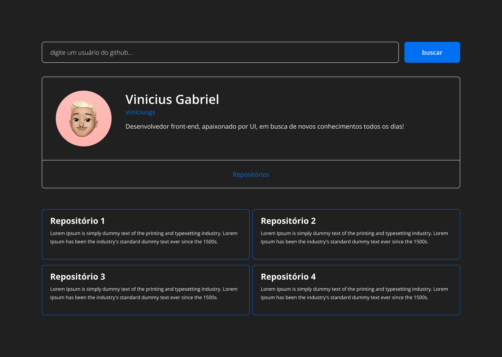

<p align="center">
  

</p>

<p align="center">
  

  

  
</p>

## ℹ️ Sobre o projeto

GitHub Search utiliza da GraphQL API do GitHub para exibir usuários e seus repositórios. O projeto foi desenvolvido com o intuito de praticar sobre o GraphQL, usei o Apollo Client para buscar e armazenar os dados da requisição. Para a interface, utilizei o TailwindCSS.

## 🧪 Tecnologias

Este projeto foi desenvolvido utilizando as seguintes tecnologias:

- [Vite](https://vitejs.dev/)
- [TypeScript](https://www.typescriptlang.org/pt/)
- [TailwindCSS](https://tailwindcss.com/)
- [GraphQL](https://graphql.org/)
- [Apollo](https://www.apollographql.com/)

## 🚀 Executando localmente

Clone o projeto e acesse a pasta.

```
git clone https://github.com/viiniciusgs/github-search

cd github-search
```

Execute este comando para instalar as dependências.

```
yarn install
```

Para utilizar da GraphQL API do GitHub você deve ter um token de acesso pessoal, siga o [tutorial](https://docs.github.com/en/authentication/keeping-your-account-and-data-secure/creating-a-personal-access-token) do GitHub de como criar um token, depois crie um arquivo .env da mesma forma à baixo e insira seu token.

```
VITE_GITHUB_TOKEN=seu_token_criado
```

Rode o projeto.

```
yarn dev
```

## 🔖 Layout

Você pode visualizar o projeto através dos links abaixo:

- [Vercel](https://github-search-viiniciusgs.vercel.app/)

- [Figma](https://www.figma.com/file/CAiqa192ZFDjnVO9DtEazw/GitHub?node-id=0%3A1)

## 📝 License

Este projeto está licenciado sob a Licença MIT. Veja o [LICENSE](LICENSE) arquivo para detalhes.

---

Feito com 💙 por [Vinicius Gabriel](https://www.linkedin.com/in/viiniciusgs/) ✌️
